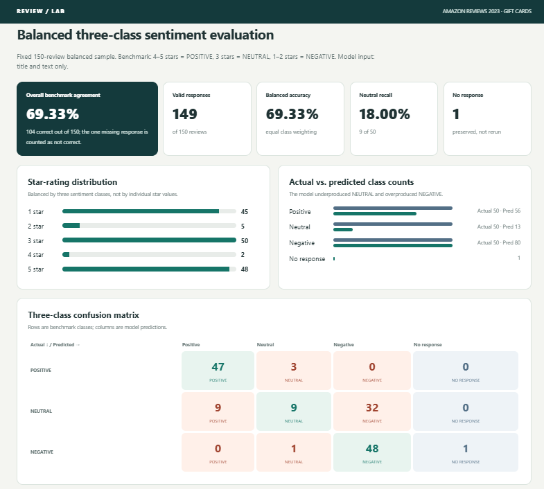

# MBAX 6418 Assignment 1 — Sentiment & Emotion Classification of Amazon Reviews

## Notes

The final dashboard is available in [`final_dashboard.html`](final_dashboard.html).



---

## Data source

The project uses the Amazon Reviews 2023 dataset collected by the McAuley Lab at UC San Diego.

- Dataset site: https://amazon-reviews-2023.github.io
- Gift Cards review file: https://mcauleylab.ucsd.edu/public_datasets/data/amazon_2023/raw/review_categories/Gift_Cards.jsonl.gz

The full Gift Cards file contains **152,410 reviews**. The raw dataset is not committed to this repository because it is large and can be downloaded again from the public source.

---

## Project workflow

### 1. Dataset validation

The compressed JSON Lines file was streamed and validated before classification. The dataset contained the expected fields, including `rating`, `title`, `text`, `verified_purchase`, `helpful_vote`, `timestamp`, `images`, `asin`, `parent_asin`, and `user_id`.

The full rating distribution was:

| Rating | Reviews |
|---|---:|
| 1 star | 12,326 |
| 2 stars | 1,873 |
| 3 stars | 3,271 |
| 4 stars | 6,692 |
| 5 stars | 128,248 |

This distribution shows why the initial experiment is highly imbalanced toward positive reviews.

### 2. Binary sentiment classification

The first reusable prompt classified reviews as either `POSITIVE` or `NEGATIVE`. The model received only title and text. For evaluation, ratings were mapped after prediction as:

- 4–5 stars → `POSITIVE`
- 1–3 stars → `NEGATIVE`

The first 100 reviews contained **93 positive** and only **7 negative** benchmark cases. The model agreed with the rating-derived benchmark on **98 of 100 reviews (98.00%)**.

| Actual class | Correct | Total | Recall |
|---|---:|---:|---:|
| POSITIVE | 92 | 93 | 98.92% |
| NEGATIVE | 6 | 7 | 85.71% |

A majority-class strategy that always predicted `POSITIVE` would already have reached **93% accuracy**, so the 98% headline number must be interpreted in the context of this imbalance.

### 3. Dashboard and filtering

The first dashboard was built as a self-contained offline HTML page. It presented the headline metrics, class imbalance, confusion matrix, review-level evidence, and the two benchmark disagreements. Interactive filters were added for all, correct, and incorrect predictions with live visible-row counts.

### 4. Primary-emotion detection

Two independent approaches were used for primary emotion:

1. **LLM emotion classification**, constrained to the eight NRC emotion categories: anger, anticipation, disgust, fear, joy, sadness, surprise, and trust.
2. **NRC Emotion Lexicon (EmoLex)** word-association scoring using the same eight emotion categories.

The NRC scorer is intentionally simple: title and text are lowercased, tokenized, and each token contributes to any linked NRC emotions. It does not interpret negation, sarcasm, word sense, or broader context.

The NRC resource used was:

> Mohammad, S. M., & Turney, P. D. (2013). Crowdsourcing a Word-Emotion Association Lexicon. *Computational Intelligence, 29*(3), 436–465. https://doi.org/10.1111/j.1467-8640.2012.00460.x

The official NRC download returned HTTP 406 during this project, so the run used a public LeXmo-hosted copy labeled v0.92. The exact source, retrieval timestamp, and checksum are preserved in [`results/nrc_source_reference.json`](results/nrc_source_reference.json).

### 5. Balanced three-class evaluation

For the final sentiment evaluation, the benchmark changed to:

- 4–5 stars → `POSITIVE`
- 3 stars → `NEUTRAL`
- 1–2 stars → `NEGATIVE`

A reproducible balanced sample was drawn from the full dataset using a fixed random seed of **20260929**. The sample contains exactly **50 reviews per class** and 150 unique reviews total.

The star composition within this balanced sentiment sample was:

| Rating | Reviews |
|---|---:|
| 1 star | 45 |
| 2 stars | 5 |
| 3 stars | 50 |
| 4 stars | 2 |
| 5 stars | 48 |

The model returned 149 valid responses. One request was interrupted and preserved as `NO_RESPONSE` rather than automatically resent.

### Final three-class results

| Actual class | Predicted POSITIVE | Predicted NEUTRAL | Predicted NEGATIVE | No response |
|---|---:|---:|---:|---:|
| POSITIVE | 47 | 3 | 0 | 0 |
| NEUTRAL | 9 | 9 | 32 | 0 |
| NEGATIVE | 0 | 1 | 48 | 1 |

Overall benchmark agreement across the full 150-review cohort was **104/150 = 69.33%**. Among the 149 completed model responses, agreement was **69.80%**.

Per-class recall across the full cohort was:

- **POSITIVE:** 47/50 = **94.00%**
- **NEUTRAL:** 9/50 = **18.00%**
- **NEGATIVE:** 48/50 = **96.00%**

The strongest failure pattern is the neutral class: **32 of 50 neutral reviews were classified as negative**, while 9 were classified as positive and only 9 were classified as neutral.

---

## Discussion questions

### 1. Why did the lopsided run look very accurate, and what changed with balanced sampling?

The first 100-review run looked incredibly accurate because **93 of the 100 benchmark labels were positive**. A classifier that ignored the review text and predicted `POSITIVE` for every row would already score 93%. The model reached 98%, but the large positive majority made the headline accuracy look significantly stronger than the evidence available for the negative class. The balanced run made the model evaluate an equal numbers of positive, neutral, and negative benchmark cases, which removed the ability to rely on the dominant positive class. It also introduced a separate `NEUTRAL` class, so the change from 98% to 69.33% is **not purely a sampling effect**. Both the sample design and the classification task changed. What the balanced run clearly revealed is that the model handled positive and negative reviews well but struggled to identify 3-star reviews as its own neutral textual class.

### 2. Which classes were confused with which, and in what direction?

The balanced confusion matrix shows that the primary error direction was **NEUTRAL → NEGATIVE**. Of the 50 benchmark-neutral reviews:

- 32 were predicted `NEGATIVE`
- 9 were predicted `POSITIVE`
- 9 were predicted `NEUTRAL`

This shows that positive and negative reviews were much more stable. Three positive reviews were called neutral, one completed negative review was called neutral, and one negative review had no captured response. There were no positive reviews classified as negative and no completed negative reviews classified as positive. This means the model was not simply confusing all three classes evenly. It was specifically reluctant to use the neutral label and tended to interpret many 3-star reviews as negative.

### 3. How did the LLM emotions and NRC emotions differ, and why?

The two emotion methods agreed on only **19 of 100 reviews (19%)**. When the 15 NRC zero-signal reviews were excluded, the exact primary-label agreement was **19 of 85 = 22.35%**.

The LLM emotion distribution was dominated by:

- `JOY`: 59
- `TRUST`: 32

The NRC primary-label distribution was dominated by:

- `ANTICIPATION`: 59
- `JOY`: 21

The difference comes from how the two methods operate. The LLM reads the title and text as a complete piece of language and can interpret context, mixed sentiment, negation, and the overall tone. The NRC method counts word-emotion associations independently meaning it does not understand whether an emotion word is negated, sarcastic, secondary to the main point, or used in a different sense. The NRC results also contained many ties: **52 reviews had a nonzero tie for the highest emotion score**, and **15 reviews had zero scores for every emotion**. A fixed tie-breaking order was used only to keep the method reproducible. Because that tie rule is arbitrary, the NRC primary-emotion label should be interpreted as a reproducible lexical summary rather than emotional ground truth.

### 4. What bugs or issues occurred, and how were they handled?

Several practical issues came up during the assignment:

- **Class imbalance:** The first 100-review run was 93% positive. I addressed this by reporting class-level recall and the majority-class baseline instead of relying only on overall accuracy.
- **Ambiguous binary reviews:** The first binary prompt had no neutral option. A fixed fallback was documented for ambiguous reviews rather than silently changing the output rules.
- **NRC ties and zero-signal reviews:** More than half of the NRC-scored reviews had tied highest emotion scores, and 15 had no emotion associations at all. The scorer saves all eight scores, records ties explicitly, and leaves zero-signal primary labels blank rather than fabricating an emotion.
- **NRC source retrieval:** The official archive returned HTTP 406. The assignment used a documented public v0.92 mirror and saved the exact URL and checksum for reproducibility.
- **Long model runs / agent interruptions:** Longer runs encountered connection and usage interruptions. The scoring code saved checkpoints after each completed response, prevented silent duplicate retries, and preserved one unresolved balanced-run request as `NO_RESPONSE` rather than inventing or automatically replacing the result.
- **Dashboard consistency:** Dashboard values were generated from saved output and checked against the confusion matrix and class counts so that displayed numbers could not silently drift away from the scoring results.

---

## Repository contents

```text
.
├── README.md
├── final_dashboard.html
├── assets/
│   └── dashboard_screenshot.png
├── data/
│   └── balanced_sample.csv
├── prompts/
│   ├── binary_sentiment_prompt.txt
│   └── three_class_sentiment_emotion_prompt.txt
├── results/
│   ├── balanced_raw_results.csv
│   ├── nrc_results_first100.csv
│   ├── nrc_source_reference.json
│   ├── step6c_confusion_matrix.csv
│   └── step6c_summary.json
└── scripts/
    ├── sample_balanced.py
    ├── run_balanced_llm.py
    ├── run_nrc.py
    └── generate_final_dashboard.py
```

The large Amazon review source file and the local NRC lexicon cache are intentionally excluded from the repository. API keys and other credentials are also excluded.

---

## Reproducing the project

### Balanced sample

```bash
python scripts/sample_balanced.py
```

The sampling script uses seed `20260929` and requires the Amazon Gift Cards `.jsonl.gz` file locally. It produces a fixed sample of 50 positive, 50 neutral, and 50 negative benchmark reviews.

### LLM classification

```bash
python scripts/run_balanced_llm.py
```

This script expects the Hermes environment used for the assignment and reuses its configured OpenAI-compatible provider. Credentials are not stored in this repository.

### NRC scoring

Download the NRC Emotion Lexicon locally, then run:

```bash
python scripts/run_nrc.py \
  --input results/balanced_raw_results.csv \
  --lexicon lexicon/NRC-Emotion-Lexicon-Wordlevel-v0.92.txt \
  --output results/nrc_results.csv
```

### Final dashboard

```bash
python scripts/generate_final_dashboard.py
```

The resulting `final_dashboard.html` is self-contained and works offline.

---

## Interpretation and limitations

The star rating is treated as the assignment benchmark, not as perfect textual ground truth. Some review text may not align cleanly with the selected star rating. This was visible even in the first 100-review experiment, where a linguistically positive 3-star review was considered negative under the initial binary benchmark. The final balanced experiment also changes both **sample composition** and **label definition**, so the 98% binary result and 69.33% three-class result should not be treated as a controlled estimate of the isolated effect of balancing. The stronger conclusion is class-specific: once a distinct neutral class was introduced and equally represented, neutral reviews were much harder for the model to identify than positive or negative reviews. Similarly, LLM-versus-NRC emotion agreement measures **agreement between methods**, not emotional accuracy. All in all, neither method provides an independently validated emotion ground truth.
